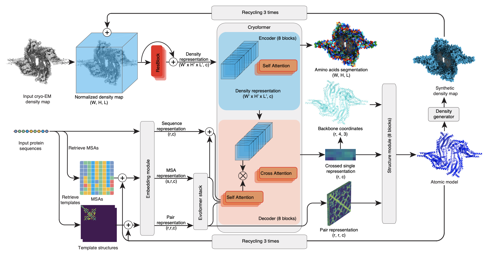
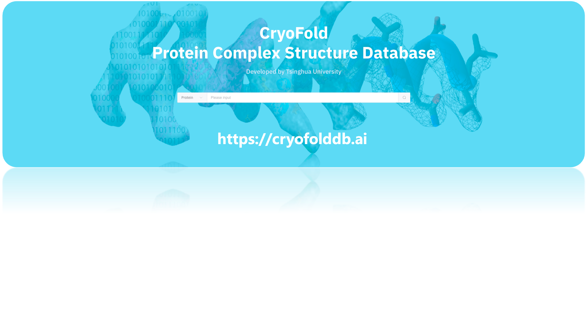

# CryoFold
<a >
   
   
   
   
</a>  

Protein complex structure determination by structure prediction with cryo-EM density map constraints.  


## CryoFold Architecture

<p align="center">
  
</p>

## Web Server
### https://cryonet/cryofold

## Introduction

<summary>Protein complex structure determination by structure prediction with cryo-EM density map constraints. </summary>

Cryo-electron microscopy (cryo-EM) has become a prominent approach for protein structure determination, especially for large protein complexes. However, obtaining high-resolution cryo-EM density maps remains challenging, particularly for the burgeoning discipline of cryo-electron tomography (cryo-ET). Here, we introduce CryoFold, a deep learning method for protein complex structure determination from cryo-EM density maps based on folding the input protein sequences within the map through multimodal data fusion. On benchmark datasets comprising hundreds of protein complexes with both intermediate- and low-resolution maps (i.e., 4~6 Å), CryoFold generated highly accurate atomic models, vastly outperforming the sequence-alone prediction tool AlphaFold-Multimer. CryoFold also performed well when using high-resolution maps (<4 Å), and notably can construct accurate models from in situ cryo-ET data of very large complexes consisting of hundreds of protein chains and low-resolution maps of 9.9 Å resolution. Finally, we used CryoFold to build models for the EMDB density maps lacking a PDB model, and established the CryoFoldDB database currently comprising 506 new models of protein complexes that are of higher average quality than deposited structures in PDB. Thus, CryoFold is a powerfully enabling technology for expanding the attainable scope of cryo-EM protein structure determination, especially for large protein complexes. 

## Pipeline


1) Prepare protein complex sequence.  
2) Prepare cryo-EM/ET density map.  
3) Perform CryoFold prediction.  

## Installation

The machine should be Linux, full installation requires up to 4 TB of disk space to keep sequence and structure databases and any GPU supports CUDA with at least 40GB memory. (Currently, the scripts for setting up and preprocess all of these databases are still in preparing. Please use the [Webserver](https://cryonet/cryofold) to run CryoFold.)


### 1. Clone the repository in your computer 
```
git clone git@github.com:kuixu/cryofold.git && cd cryofold
```

### 2. Configure environment for CryoFold.
#### 2.1 Install conda
Install miniconda from https://mirrors.tuna.tsinghua.edu.cn/anaconda/miniconda/.

#### 2.2 Create environment 
Create the environment via yml file
```commandline
conda env create -f environment.yml
```

#### 2.3 Activate environment 
Activate the environment to run this software, simply by
```
conda activate cryofold
conda deactivate (If you want to exit) 
```

### 3. Compile CUDA kernels
Compile CUDA kernels like attention module, fastsoftmax, and layernorm, simply by
```
python setup.py install
```

### 4. Download the sequence and structure databases

CryoFold needs multiple sequence ([PDB seqres](https://www.rcsb.org/), [UniProt](https://www.uniprot.org/uniprot/), [UniRef90](https://www.uniprot.org/help/uniref), [UniClust30](https://uniclust.mmseqs.com/), [MGnify](https://www.ebi.ac.uk/metagenomics/), [BFD](https://bfd.mmseqs.com/), [MetaEuk](https://mmseqs.com/metaeuk), 
[SMAG](https://smag.microbmalab.cn), and [PDB70](http://wwwuser.gwdg.de/~compbiol/data/hhsuite/databases/hhsuite_dbs/)) and structure ([PDB](https://www.rcsb.org/))databases to run. (Currently, the scripts for setting up and preprocess all of these databases are still in preparing. Please use the [Webserver](https://cryonet/cryofold) to run CryoFold.)


### 5. Download model weights

Download the pre-trained model weights and put them in the weights directory, e.g.
make a directory ``params`` and then download our pretrained model in this directory. <br>

You can also use command line to do this
```commandline
mkdir params
cd params
wget https://cryofolddb.oss-cn-beijing.aliyuncs.com/weights/cryofold_v1.zip
unzip cryofold_v1.zip
```


# Usage

<summary>Command Parameters</summary>

```commandline

python3 infer.py \
    --seq FASTA.fasta \
    --map MAP.mrc \
    --recycle RECYCLE_TIMES \
    --gpu_device GPU_DEVICE \ 
    --checkpoint_path CHECKPOINT_PATH \
    --output_dir ./ \


```
[FASTA.fasta] is the path of the input sequence file with *.fasta format. [MAP.mrc] is the path of the input cryo-EM/ET map. [RECYCLE_TIMES] specifies the recycle time, and the default value is 8. [CHECKPOINT_PATH] specifies the checkpoint path, and the default value is 'params/cryofold_v1'. [GPU_DEVICE] specifies the GPU device ID.

Example of FASTA.fasta file
```
>A
MITDSLAVVLQRRDWENPGVTQLNRLAAHPPFASWRNSEEARTDRPSQQLRS
>B
MITDSLAVVLQRRDWENPGVTQLNRLAAHPPFASWRNSEEARTDRPSQQLRS
>C
MITDSLAVVLQRRDWENPGVTQLNRLAAHPPFASWRNSEEARTDRPSQQLRS
>D
MITDSLAVVLQRRDWENPGVTQLNRLAAHPPFASWRNSEEARTDRPSQQLRS
```

For the description line, you could provide the chain id without any other information. For multiple chains case, each polypipetide chain ocuppies a separate sequence, i.e. Num. of chain == Num. of sequence.
<br> In this example, we have 4 chains sharing the identical sequences.

After running the script, the generated predictive model file will be stored in the directory as ``./[MAP]_cryofold.pdb``. 


### Example Command
```commandline

python3 infer.py \
    --seq example/7770.fasta \
    --map example/7770.mrc \
    --recycle 8 \
    --gpu_device 0 \ 
    --checkpoint_path params/cryofold_v1 \
    --output_dir ./ \

```


## CryoFoldDB
### https://cryofolddb.ai


<p align="center">
  
</p>

## Copyright (C)

Protein complex structure determination by structure prediction with cryo-EM density map constraints.
Copyright (C) 2024. Kui Xu, Zhuo-Er Dong, Xing Zhang, Xin You, Pan Li, Nan Liu, Muzhi Dai, Chuangye Yan, Nieng Yan, Hong-Wei Wang, Sen-Fang Sui, Qiangfeng Cliff Zhang.
License: MIT 
