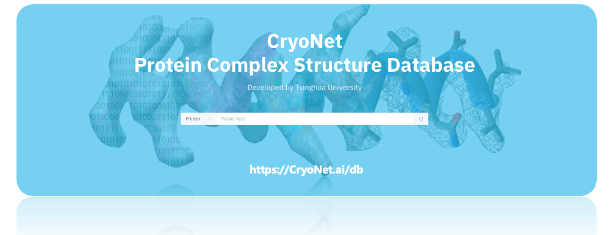

# CryoNet.Fold
<a >
   
   
   
   
</a>  

Protein complex structure determination by structure prediction with cryo-EM density map constraints.  

## CryoNet.Fold Architecture

<p align="center">
  
</p>

## Introduction

<summary>Protein complex structure determination by structure prediction with cryo-EM density map constraints. </summary>

Cryo-electron microscopy (cryo-EM) has become a prominent approach for protein structure determination, yet obtaining high-resolution cryo-EM density maps is often challenging. Here, we introduce CryoNet.Fold, a deep learning method that combines computational structural prediction and protein complex structure determination from cryo-EM density maps through multimodal data fusion. CryoNet.Fold generated highly accurate atomic models, both for high-resolution maps (<4 Å) and notably for intermediate- to low-resolution maps (i.e., 4~6 Å), and successfully constructed accurate models from in situ cryo-electron tomography (cryo-ET) data for very large complexes of hundreds of protein chains and low-resolution maps of ~10 Å resolution. We applied CryoNet.Fold to the unmodelled density maps in EMDB, establishing the CryoNet.DB database currently comprising 710 new models of protein complexes, with higher average quality than deposited structures in PDB. Thus, CryoNet.Fold effectively merges the field of cryo-EM and AI-based computational structural biology, expanding the attainable scope of cryo-EM protein structure determination.


## Usage

We provide three ways to run CryoNet.Fold:

### 1. Web Server

https://cryonet.ai/fold

Tutorial of the CryoNet.Fold web server: https://cryonet.ai/fold_docs


### 2. Using API

```commandline
python3 main.py \
    --map MAP.mrc \
    --sequence FASTA.fasta \
    -r RESOLUTION \
    -n NUM_RECYCLE \
    -o OUTFILE \

```

### 3. Standalone Installation

We would release the installation package upon paper publication. You may check the following prerequisite:

1. up to 4 TB of disk space to keep sequence and structure databases
2. a GPU supports CUDA with at least 40GB memory. 


## Input files

[MAP.mrc] is the file path of the input cryo-EM/ET map. 
[FASTA.fasta] is the file path of the input sequence file with *.fasta format. 
[RESOLUTION] specifies the resolution of the density map. 
[NUM_RECYCLE] sets the number of recycling iterations, with a default value of 100.
[OUTFILE] specifies the file path for the output file.
[--no_refine] disables the refinement step.

Example of FASTA.fasta file
```
>A
MITDSLAVVLQRRDWENPGVTQLNRLAAHPPFASWRNSEEARTDRPSQQLRS
>B
MITDSLAVVLQRRDWENPGVTQLNRLAAHPPFASWRNSEEARTDRPSQQLRS
>C
MITDSLAVVLQRRDWENPGVTQLNRLAAHPPFASWRNSEEARTDRPSQQLRS
>D
MITDSLAVVLQRRDWENPGVTQLNRLAAHPPFASWRNSEEARTDRPSQQLRS
```

For the description line, you could provide the chain id without any other information. For multiple chains case, each polypipetide chain ocuppies a separate sequence, i.e. Num. of chain == Num. of sequence.
<br> In this example, we have 4 chains sharing the identical sequences.

## Output files

After running the script, the generated predictive model file will be stored in the directory as ``./[MAP]_cryofold.pdb``. 


## CryoNet.DB

https://cryonet.ai/db


<p align="center">
  
</p>

## Copyright (C)

Protein complex structure determination by structure prediction with cryo-EM density map constraints.
Copyright (C) 2024. Kui Xu, Zhuo-Er Dong, Xing Zhang, Xin You, Pan Li, Nan Liu, Muzhi Dai, Chuangye Yan, Nieng Yan, Hong-Wei Wang, Sen-Fang Sui, Qiangfeng Cliff Zhang.
License: MIT 
